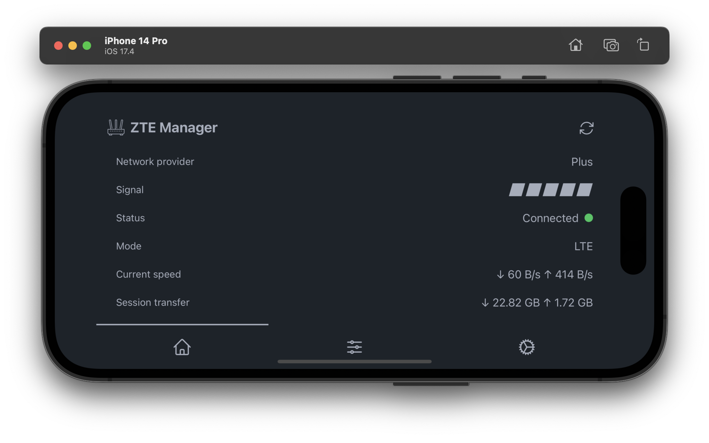
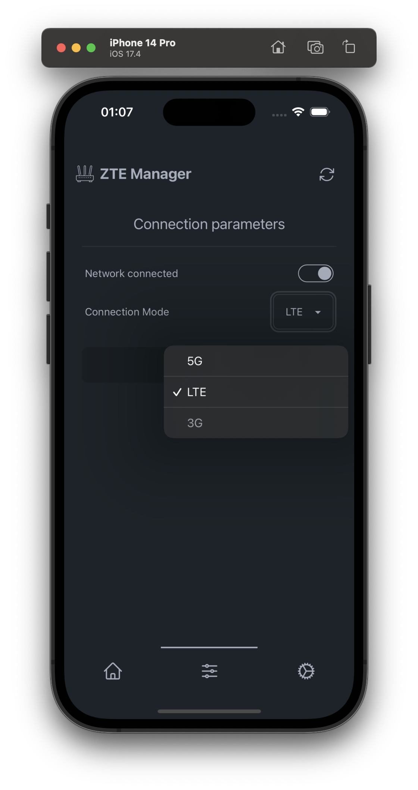

# Zetapp

PoC manager for ZTE powered modems.
Currently supports only MC889 but MF283 is planned as well.

### Why?

I wanted to checkout how Tauri v2 beta is doing and how it works on iOS.

Also I had the idea for a small app that would make it easier to manage my ZTE modem. 
Quite often I need to swap between 5G and 4G bands or just to check how my monthly data plan usage is going. 

## Stack

- Rust nightly (async + trait + dyn are still kinda hard to achieve)
- Typescript
- Tauri v2 beta
- SolidJS
- Tailwind + DaisyUI

## Requirements

- Xcode
- pnpm
- cargo
- rustc
- node (tauri v2 beta seems to have broken bun generator)
- pnpm 

## Building

1. `pnpm install`
2. `pnpm run tauri ios init`
3. `pnpm run tauri ios build -o` 

## Developing

1. `pnpm install`
2. `pnpm run tauri dev`

## Screenshots

### Desktop

### Mobile iOS

### Screens

